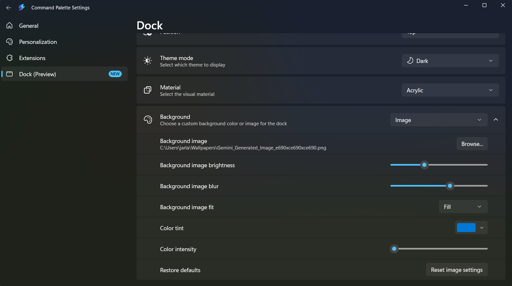

# palette

Config and ideas for Command palette (Power Toys).

## Backgrounds

Custom background images for the palette are in [`/backgrounds`](./backgrounds/).

To get the best result, set the dock background to **Image** mode with **Fill** fit. See the config below:

| File | Preview |
|------|---------|
| `bg_1.png` |  |
| `bg_2.png` |  |
| `bg_3.png` |  |

## Ideas / Wishlist

### Animated creatures
- **Walking cat** — tiny pixel cat walks across the bar
- **Pixel crab** — sideways scuttling crab that bounces off the edges
- **Snake** — a little snake that slithers around and grows over time

### Reacts to your PC
- **CPU fire** — a tiny flame that grows taller as CPU usage spikes
- **RAM chomper** — a pac-man that gets fatter the more RAM you're using
- **Disk spinner** — a drill that spins faster during disk I/O

### Dumb but charming
- **Bouncing DVD logo** — it just bounces. eternal.
- **Tamagotchi** — a tiny pet that gets sad if you don't open the palette often enough
- **Progress bar to the weekend** — always visible, always judging

### Chaotic
- **Stock ticker** — fake companies: `COPE +4.2%`, `CRINGE -12%`, `GRIND +0.1%`
- **Live "thoughts"** — scrolling marquee: *"have you committed today?"*, *"that variable name is a choice"*

### Clippy specifically
- **Clippy** — sits in the corner, occasionally pops a speech bubble: *"It looks like you're opening the palette. Need help?"*, *"Have you tried turning it off and on again?"*
- Reacts to time of day: *"Still coding at 2am? Interesting choice."*
- Gets increasingly unhinged the longer your PC uptime is

### More old school nostalgia
- **Bonzi Buddy** — the purple gorilla. says nothing. just watches.
- **Flying Toasters** — the After Dark screensaver but in the dock strip
- **Bob** (Microsoft Bob) — a little house that you can never actually enter
- **XP Error Dog** — the "did you mean...?" search dog from Windows XP just vibing

### Cursed productivity
- **Pomodoro Tomato** — a tiny tomato that slowly turns red then explodes
- **Shame Counter** — counts how many times you've opened and closed the palette without doing anything
- **The Time** — just the current time, but displayed wrong by exactly 1 minute to keep you anxious
- **Git Blame Face** — a face that gets more disappointed as your uncommitted changes pile up

### Status bar / rice-style readouts
Things you'd see in a polybar/waybar/eww setup

- [ ] **Battery status** — percentage, charging state, and estimated time remaining
- [ ] **Power draw** — current wattage being drawn from the wall / battery
- [ ] **CPU usage** — current % across all cores, with per-core breakdown on demand
- [ ] **RAM usage** — used / total, with top memory consumers listed
- [ ] **GPU usage + VRAM** — utilisation % and VRAM used / total (NVIDIA/AMD)
- [ ] **CPU / GPU temperature** — current temp with a configurable warning threshold
- [ ] **Fan speeds** — RPM for each fan reported by the hardware
- [ ] **Disk usage** — used / free per drive, with a bar indicator
- [ ] **Network throughput** — live upload / download speed for the active interface
- [ ] **WiFi signal + SSID** — current network name and signal strength
- [ ] **System uptime** — how long since last boot, formatted cleanly
- [ ] **Volume level** — current output volume, mute state, active sink name
- [ ] **Microphone status** — live indicator showing if mic is active/muted
- [ ] **Screen brightness** — current brightness %, adjustable inline
- [ ] **Now playing** — track + artist from Spotify or system media session, with play/pause/skip controls inline
- [ ] **Audio visualiser** — live EQ bar graph of system audio output, rendered as ASCII/Unicode blocks in the palette
- [ ] **Weather snapshot** — current conditions and temperature for your location (wttr.in style, no browser)
- [ ] **Active window info** — title + process name of the currently focused window
- [ ] **Virtual desktop indicator** — show which desktop you're on and switch inline
- [ ] **Notification count** — pending Windows notifications, dismiss or jump to app from palette
- [ ] **Do Not Disturb toggle** — flip Windows Focus Assist on/off from the palette
- [ ] **Clock readout** — current time in a custom format (with seconds), useful as a quick glance without alt-tabbing
- [ ] **Keyboard layout indicator** — current input language/layout, switch inline
- [ ] **Pending updates** — count of available winget / Windows Update packages, open update UI on enter
- [ ] **GitHub notifications** — unread notification count, open inbox on enter
- [ ] **Todo count** — pull open item count from a local file or Todoist
- [ ] **Color scheme switcher** — cycle between saved accent palettes (pywal-style, applied system-wide)
- [ ] **Kernel / OS info** — Windows build, uptime, hostname — neofetch in a keystroke

### System state
- [ ] Toggle dark/light mode
- [ ] Toggle night light (f.lux style, instant)
- [ ] Switch audio output device (headphones ↔ speakers ↔ monitor)
- [ ] Set a focus timer (25min, no notifications)
- [ ] Toggle mic mute system-wide

### Network / privacy
- [ ] VPN on/off (WireGuard)
- [ ] Toggle WiFi
- [ ] Flush DNS cache
- [ ] Show my public IP

### Window management
- [ ] Snap current layout as a "saved session"
- [ ] Restore last session layout
- [ ] Kill all except current window

### Dev one-clicks
- [ ] Start local dev server (repo-aware)
- [ ] Kill port (pick from occupied ports list)
- [ ] Copy local IP to clipboard
- [ ] Git pull all repos in a folder

### Content / clipboard
- [ ] OCR screenshot → clipboard (snip + extract text instantly)
- [ ] Paste as plain text (strips formatting)
- [ ] Shrink clipboard image to X% before pasting
- [ ] Translate clipboard text

### The spicy ones
- [ ] **Coffee mode** — mutes all, kills Slack/Teams, sets a timer, plays focus playlist
- [ ] **Stream ready** — launches OBS, sets audio to headset, closes distracting apps
- [ ] **Share this** — takes screenshot, uploads somewhere, copies link to clipboard

### Dev / Productivity
- [ ] **Dependency version checker** — paste a lib name, get latest version from Maven Central / npm
- [ ] **Color picker to hex/rgb** — invoke PowerToys color picker from palette, copy result in your format of choice
- [ ] **Cron expression explainer** — type `0 */6 * * *`, get "every 6 hours" in plain English
- [ ] **HTTP status code lookup** — type 418, get the teapot
- [ ] **UUID generator** — one keypress, fresh UUID in clipboard
- [ ] **Gitignore generator** — type "Android Kotlin", get a ready gitignore (gitignore.io without the browser tab)
- [ ] **Changelog viewer** — type a repo, pull latest GitHub releases inline
- [ ] **ADB commands** — list connected devices, restart, clear app data, pull logcat
- [ ] **Gradle task runner** — search tasks in a project, run them from palette
- [ ] **Git stash browser** — list stashes by name, pop/drop/apply inline
- [ ] **IP lookup** — type an IP, get geolocation + reverse DNS
- [ ] **Base64 / hash tools** — encode/decode, md5/sha inline
- [ ] **Regex tester** — type a pattern, test against an inline string, get match results
- [ ] **JSON formatter** — paste ugly JSON, get it pretty, with a copy button
- [ ] **Timezone converter** — "what time is 3pm EST in my timezone" without opening worldtimeserver.com

### Windows power user
- [ ] **Kill process by name** — fuzzy search running processes, kill on enter
- [ ] **Hosts file manager** — list/add/toggle entries without running Notepad as admin
- [ ] **Env variable viewer** — search environment variables, copy values
- [ ] **Startup manager** — see/toggle what runs at startup, light alternative to Autoruns
- [ ] **Wi-Fi password revealer** — shows saved network passwords via `netsh`
- [ ] **Recently modified files** — list files changed in the last N minutes across a configured directory
- [ ] **Window opacity slider** — set transparency on the currently focused window
- [ ] **Clipboard history search** — searchable clipboard with fuzzy matching

### Wacky / fun
- [ ] **Random excuse generator** — professionally-worded reason to not attend a meeting, copy to clipboard
- [ ] **Coin flip / dice roll / random picker** — for the truly indecisive
- [ ] **Things bot shortcut** — type an entry directly into your Telegram things bot, POST to the Railway bot without opening Telegram
- [ ] **Soulslike death counter** — track deaths per boss, save to a file
- [ ] **Daily wisdom** — pull a random quote from a local JSON file (Dark Souls messages, "Therefore, seek..." etc.)

### Unhinged
- [ ] **Excuse-driven development** — "why didn't you ship" → blame-the-infrastructure excuse formatted as a Slack message, ready to paste
- [ ] **Meeting energy level calculator** — input how many meetings you have today → outputs whether you're allowed to be productive
- [ ] **Passive aggressive commit message generator** — "fixed it again because apparently last time wasn't enough"
- [ ] **Copium dispenser** — type a bad metric ("0 blog views today"), get it reframed positively (Wall Street Bets flair)
- [ ] **Dark Souls message builder** — construct a valid DS message from the actual word pool, copy to clipboard for use anywhere